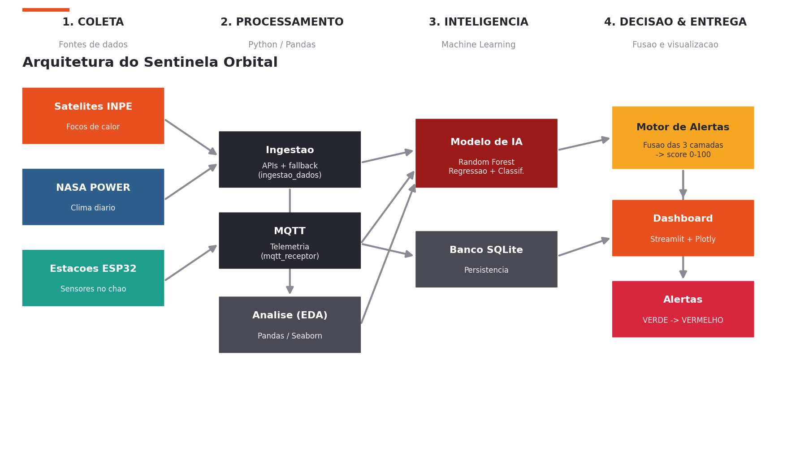
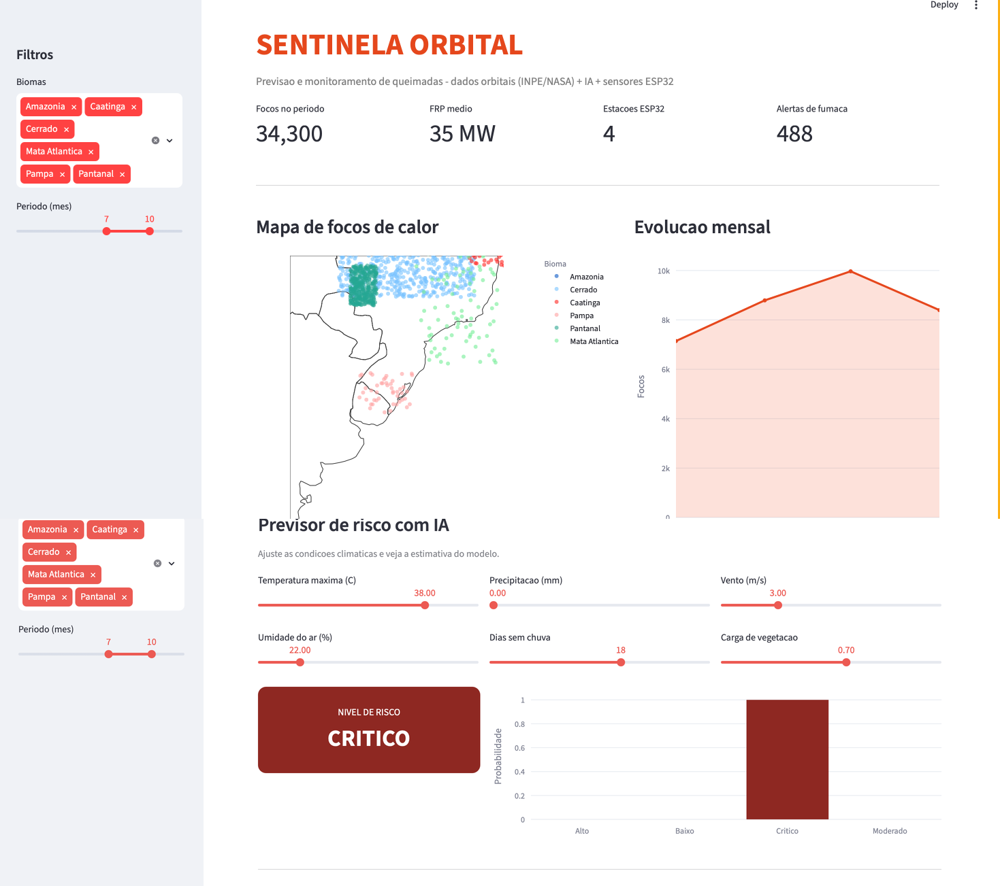
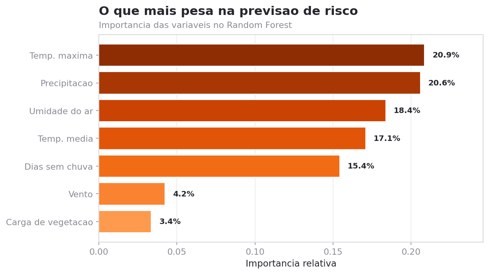
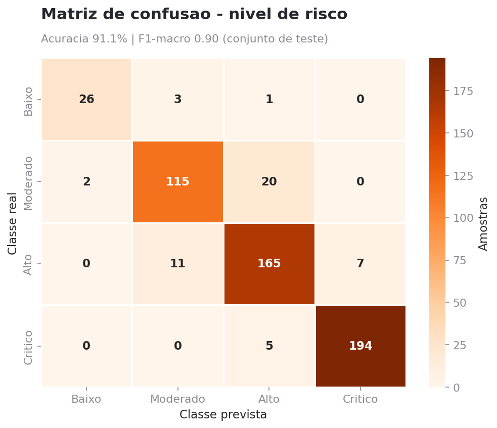

# FIAP, Faculdade de Informática e Administração Paulista

<p align="center">
  <a href="https://www.fiap.com.br/">
    
  </a>
</p>

<br>

# Sentinela Orbital

### Previsão e monitoramento inteligente de queimadas combinando dados orbitais, IA climática e sensores de borda (ESP32)

> **Global Solution 2026.1, FIAP**
> Tema: *Como a tecnologia espacial pode melhorar a vida das pessoas, tornar processos mais eficientes e criar novas oportunidades na Terra.*

## Nome do grupo: Sentinela Orbital

> **QUERO CONCORRER.** Este projeto está concorrendo à premiação (pódio) da Global Solution 2026.1.

## 👨‍🎓 Integrantes

- Karina Garta Szewczuk (RM569309)
- Maria Sabrina Feitosa da Silva (RM568714)
- Nicolas Lima Apolinário (RM570741)
- Roger Gabriel de Souza Jesus Costa (RM573659)

## 👩‍🏫 Professores

### Tutora

- Sabrina Otoni

### Coordenador

- Andre Godoi

---

## 📜 Descrição

### O problema

O Brasil registra **centenas de milhares de focos de calor por ano**, concentrados na estação seca (julho a outubro) e nos biomas Amazônia e Cerrado. Os satélites do INPE detectam o fogo com excelência, mas detectam o fogo **que já começou**, e muitas vezes com horas de defasagem entre a passagem do satélite e a chegada do alerta a quem pode agir.

**A pergunta que guia o projeto:** e se pudéssemos *prever* o risco antes do fogo e *confirmar* o início da queimada no chão, em minutos?

### A solução

O **Sentinela Orbital** integra três camadas de informação em um único sistema de previsão e alerta:

1. **Camada orbital**: focos de calor (padrão INPE) e variáveis climáticas (padrão NASA POWER).
2. **Camada de inteligência**: modelos de Machine Learning que preveem a quantidade de focos e classificam o nível de risco a partir do clima.
3. **Camada de borda (edge)**: estações com **ESP32** e sensores instaladas em pontos críticos, que medem as condições locais, decidem o alerta na própria placa (mesmo offline) e publicam a telemetria via **MQTT**.

Um **motor de fusão** combina as três camadas em um score de 0 a 100 por bioma, que vira um alerta operacional (VERDE → VERMELHO), tudo visível em um **dashboard interativo**.



### Como funciona

```
Satélites INPE  ─┐
NASA POWER      ─┼─► Ingestão ─► Análise (Pandas) ─► Modelo de IA ─┐
Estações ESP32  ─┘      ▲                          (Random Forest)  │
                        └── MQTT ───────────────────────────────────┤
                                                                     ▼
                                              Motor de Alertas (fusão das 3 camadas)
                                                                     │
                                                       ┌─────────────┴─────────────┐
                                                       ▼                           ▼
                                                  Dashboard                    Alertas
                                              (Streamlit + Plotly)         (VERDE→VERMELHO)
```



### Resultados

Os modelos foram treinados sobre o cruzamento clima × focos (pares bioma/dia):

| Tarefa | Modelo | Métrica | Resultado |
|---|---|---|---|
| Prever nº de focos | Regressão Linear | R² | 0,48 |
| Prever nº de focos | **Random Forest** | **R²** | **0,96** |
| Classificar risco | **Random Forest** | **Acurácia** | **91,1%** |
| Classificar risco | Random Forest | F1-macro | 0,90 |

As variáveis mais decisivas para o risco, temperatura máxima, precipitação, umidade e dias sem chuva, coincidem com a ciência do fogo, o que dá **interpretabilidade** ao modelo.

| Importância das variáveis | Matriz de confusão |
|---|---|
|  |  |

### Tecnologias utilizadas

| Camada | Tecnologias |
|---|---|
| Linguagem | Python 3.10+ |
| Dados & Análise | Pandas, NumPy |
| Machine Learning | scikit-learn (Random Forest, Regressão Linear), joblib |
| Visualização | Matplotlib, Seaborn, Plotly |
| Dashboard | Streamlit |
| IoT / Edge | ESP32 (Arduino C++ e MicroPython), sensores BME280 / MQ-135 / solo |
| Comunicação | MQTT (paho-mqtt) |
| Banco de dados | SQLite |
| Integração | APIs INPE (Programa Queimadas) e NASA POWER |

---

## 📁 Estrutura de pastas

```
sentinela-orbital/
├── README.md                  # este arquivo
├── requirements.txt           # dependências
├── assets/                    # gráficos, diagramas e a logo da FIAP
├── dados/                     # bases geradas (CSV) + banco SQLite
├── docs/                      # arquitetura da solução
├── firmware/                  # código do ESP32 (ver firmware/README.md)
│   ├── sentinela_esp32.ino        # firmware Arduino C++
│   ├── sentinela_esp32_micropython.py
│   └── README.md
├── modelos/                   # modelos treinados (.joblib) + métricas
└── src/                       # código-fonte (ver src/README.md)
    ├── gerar_dados.py             # gera as bases sintéticas realistas
    ├── estilo_viz.py              # identidade visual dos gráficos
    ├── analise_exploratoria.py    # EDA + gráficos
    ├── modelo_risco.py            # treino dos modelos de ML
    ├── ingestao_dados.py          # integração com APIs INPE/NASA (+ fallback)
    ├── mqtt_receptor.py           # recebe telemetria ESP32 e aplica a IA
    ├── motor_alertas.py           # funde as 3 camadas e gera alertas
    ├── dashboard.py               # dashboard Streamlit + Plotly
    ├── gerar_preview_dashboard.py # imagem do dashboard p/ documentação
    ├── gerar_arquitetura.py       # diagramas de arquitetura
    └── gerar_pdf.py               # gera o PDF oficial da entrega
```

---

## 🔧 Como executar o código

> Pré-requisito: **Python 3.10+**. Recomenda-se um ambiente virtual.

```bash
# 1) Clonar o repositório
git clone https://github.com/msaabriina/sentinela-orbital.git
cd sentinela-orbital

# 2) (Opcional) criar e ativar um ambiente virtual
python -m venv venv
source venv/bin/activate        # Windows: venv\Scripts\activate

# 3) Instalar as dependências
pip install -r requirements.txt

# 4) Gerar as bases de dados
cd src
python gerar_dados.py

# 5) Rodar a análise exploratória (gera os gráficos em /assets)
python analise_exploratoria.py

# 6) Treinar os modelos de IA (salva em /modelos e gera gráficos)
python modelo_risco.py

# 7) Simular a recepção de telemetria dos ESP32 (aplica a IA + grava no SQLite)
python mqtt_receptor.py --sim

# 8) Gerar o painel de alertas (fusão das 3 camadas)
python motor_alertas.py

# 9) Abrir o dashboard interativo
streamlit run dashboard.py
```

### Sobre os dados

Por se tratar de uma POC acadêmica executada **sem acesso garantido às APIs externas**, o projeto usa **dados sintéticos modelados a partir de padrões reais** (sazonalidade da estação seca, distribuição por bioma, satélites efetivamente usados pelo INPE e correlações físicas entre clima e risco). O módulo `ingestao_dados.py` já contém a integração **real** com as APIs do INPE e da NASA POWER e faz *fallback* automático para as bases locais quando não há internet, ou seja, **basta haver conexão para usar dados ao vivo**, sem mudar o restante do pipeline.

### Sobre o firmware ESP32

O código em `firmware/` é **real e compilável** na Arduino IDE / PlatformIO. Como a banca pode não dispor do hardware, o módulo `mqtt_receptor.py --sim` reproduz fielmente o fluxo de telemetria a partir dos dados das estações, permitindo testar todo o sistema ponta a ponta sem placa física.

### Vídeo demonstrativo

[LINK DO VÍDEO NO YOUTUBE, NÃO LISTADO]

> Substitua pelo link do vídeo (≤ 5 min, configurado como **Não listado**).

---

## 🗃 Histórico de lançamentos

- 0.1.0, 9 de junho de 2026: versão inicial da entrega da Global Solution 2026.1 (pipeline completo de dados, modelos de IA, firmware ESP32, motor de fusão e dashboard).

---

## 📋 Licença

<p align="center">
  <a href="https://creativecommons.org/licenses/by/4.0/?ref=chooser-v1">
    
    
  </a>
</p>

Projeto acadêmico desenvolvido para a Global Solution 2026.1 da FIAP. Dados de referência inspirados no **Programa Queimadas/INPE** e na **NASA POWER**.

Este projeto segue o modelo de repositório da FIAP e está licenciado sob [Attribution 4.0 International (CC BY 4.0)](https://creativecommons.org/licenses/by/4.0/?ref=chooser-v1).
